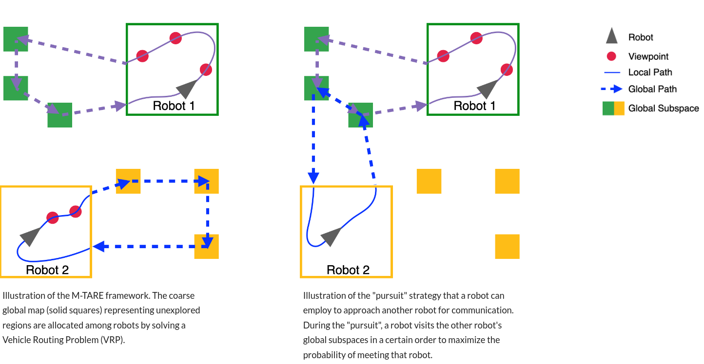
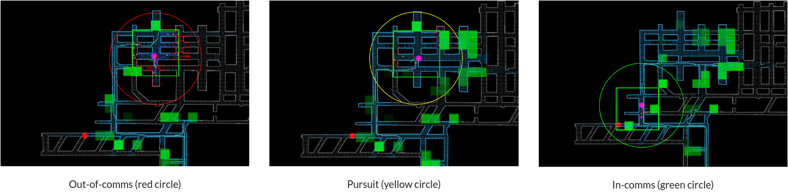
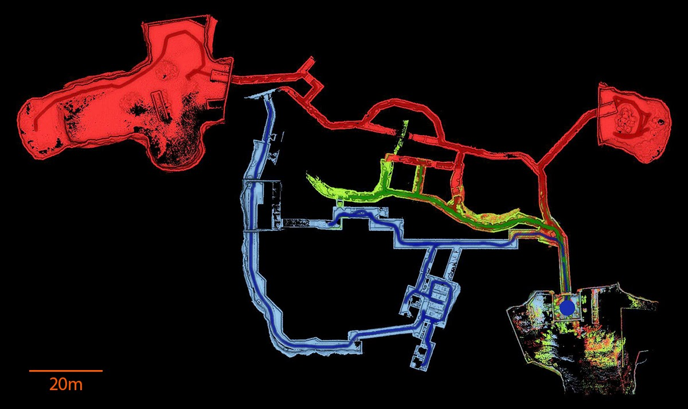

M-TARE is a multi-robot version of the [TARE planner](https://github.com/caochao39/tare_planner). Under the same hierarchical framework as TARE, M-TARE utilizes the coarse global-level map for coordinating multiple robots to achieve computational, bandwidth, and exploration efficiency. In particular, robots running the M-TARE planner share a coarsely discretized grid map among each other to keep track of explored and unexplored areas. To overcome communication constraints, robots employ a "pursuit" strategy to approach other robots when a potential information exchange can lead to a faster exploration overall and maximize the probability of approaching the other robots during the pursuit. The figures below illustrate the M-TARE framework and the "pursuit" strategy. 
<p align="center">
  
</p>

Please use instructions on our [project page](https://www.cmu-exploration.com/m-tare-planner).

## Quick Start
### Install Dependencies
M-TARE can be quickly set up and tested using Docker. Make sure Docker, Docker Compose, NVIDIA Container Toolkit, and Nvidia GPU Driver (last two for computers with NVIDIA GPUs) are installed on your computer. Instructions for installation can be found [here](https://docs.docker.com/get-started/) and [here](https://docs.nvidia.com/datacenter/cloud-native/container-toolkit/latest/install-guide.html). A brief installation instruction is provided on our [project page](https://www.cmu-exploration.com/m-tare-planner). To verify the installation, use the following commands.
```
docker -v 
>>>>> Docker version xx.x.x, build xxxxxxx

docker compose version
>>>>> Docker Compose version vx.x.x
```
For computers with NVIDIA GPUs:
```
docker run --gpus all --rm nvidia/cuda:11.0.3-base-ubuntu20.04 nvidia-smi
>>>>> Sat Dec 16 17:27:17 2023       
+-----------------------------------------------------------------------------+
| NVIDIA-SMI 525.125.06   Driver Version: 525.125.06   CUDA Version: 12.0     |
|-------------------------------+----------------------+----------------------+
| GPU  Name        Persistence-M| Bus-Id        Disp.A | Volatile Uncorr. ECC |
| Fan  Temp  Perf  Pwr:Usage/Cap|         Memory-Usage | GPU-Util  Compute M. |
|                               |                      |               MIG M. |
|===============================+======================+======================|
|   0  NVIDIA GeForce ...  Off  | 00000000:01:00.0  On |                  N/A |
| 24%   50C    P0    40W / 200W |    918MiB /  8192MiB |      3%      Default |
|                               |                      |                  N/A |
+-------------------------------+----------------------+----------------------+
                                                                               
+-----------------------------------------------------------------------------+
| Processes:                                                                  |
|  GPU   GI   CI        PID   Type   Process name                  GPU Memory |
|        ID   ID                                                   Usage      |
|=============================================================================|
+-----------------------------------------------------------------------------+
```

Install additional packages.
```
sudo apt install tmux tmuxp net-tools
```

### Get the Docker Image and Launch Scripts
Pull the docker image.
```
docker pull caochao/mtare-open-source:latest
```
Clone the launch scripts.
```
git clone https://github.com/caochao39/mtare_docker.git
```
We recommend using our custom tmux configuration. Copy the file to the home folder.
```
cd mtare_docker
cp .tmux.conf ~/
```

### Set up the Network
To run multiple simulated robots on a **single computer**: 

1. Make sure a wired or wireless network interface is up. Use ifconfig to find out the name of the interface, e.g., ```enp0s31f6```, ```eno1```, ```wlp3s0```, etc. The name of this interface will be used in later steps. If there is no wired or wireless network interface present, use ip link to list all network interfaces, identify the interface you want to use (e.g., ```enp0s31f6```, ```eno1```, ```wlp3s0```, etc.), and use ```sudo ip link set <interface-name> up``` to bring it up. 

2. In the file ```mtare_docker/docker-compose-network.yml```: make sure the line ```driver: macvlan``` is commented out to be ```# driver: macvlan``` and the line ```driver: bridge``` is uncommented.

To run multiple simulated robots across **different computers**: 

When connecting computers to a local network via a switch or a direct cable, we recommend assigning a static IP to each computer manually. In cases where a router is part of the local network setup, you can use either static IP or automatic IP addressing (DHCP) based on the router's settings.

1. Connect each computer to the same local network using Ethernet cables, do NOT use wireless connections.

2. Confirm that the computers can ```ping``` each other.

3. On each computer, use the ```ifconfig``` command to find out the name of the wired Ethernet interface connected to the local network, e.g., ```enp0s31f6```, ```eno1```, etc. The name of this Ethernet interface will be used in later steps.

4. In the file ```mtare_docker/docker-compose-network.yml```: make sure the line ```driver: bridge``` is commented out to be ```# driver: bridge``` and the line ```driver: macvlan``` is uncommented.

### Launch Robots
In a terminal, use the following command to allow docker to connect to the X server to show the RVIZ GUI (Can be undone by ```xhost -``` afterward).
```
xhost +
```
Now you can run a script to launch a robot. Here assume the name of the Ethernet interface is eno1. **Please change the name of the Ethernet interface accordingly.**
```
./run_mtare.sh tunnel 30 2 0 eno1
```
The last command does the following:

1. Launches the simulated ```tunnel``` environment, as described in the [Autonomous Exploration Development Environment](https://github.com/HongbiaoZ/autonomous_exploration_development_environment),

2. Specifies the communication range between the robots as ```30``` m,

3. Specifies the number of robots in total as ```2```,

4. Launches a robot with ID ```0```.

5. Specifies the Ethernet interface to use.

The requirements for the arguments are given below.
```
Usage: run_mtare.sh <envrionment> <comms_range> <robot_num> <robot_id> <network_interface>
  - <envrionment>: The environment to explore, which should be one of the following: tunnel, garage, campus, indoor, forest
  - <comms_range>: Communication range in meters, two robots further than this range cannot communicate with each other
  - <robot_num>: Total number of robots
  - <robot_id>: Robot id, ranging from 0 to robot_num - 1
  - <network_interface>: Name of the network interface to use, e.g. eth0
```
In another terminal (this can be on a different computer that went through the same setup steps above):
```
./run_mtare.sh tunnel 30 2 1 eno1
```
To launch more than 2 robots, simply run ```./run_mtare.sh``` in new terminals. **Make sure to supply the same** ```robot_num``` **argument to all launches**. The ```robot_id```s need to range from ```0``` to ```robot_num - 1```. For example, to launch 5 robots:
In terminal 1:
```
./run_mtare.sh tunnel 30 5 0 eno1
```
In terminal 2:
```
./run_mtare.sh tunnel 30 5 1 eno1
```
In terminal 3:
```
./run_mtare.sh tunnel 30 5 2 eno1
```
In terminal 4:
```
./run_mtare.sh tunnel 30 5 3 eno1
```
In terminal 5:
```
./run_mtare.sh tunnel 30 5 4 eno1
```
Note: To verify that the robots can communicate with each other, start the robots at the same time and **observe that the circles indicating the communication range turn green**.

### Stop Robots
In a separate terminal, use the script ```mtare_docker/stop.sh``` to stop the robots on a computer. This script will kill relevant tmux sessions, stop and remove the docker containers. The usage is as follows:
1. Stop all robots: simply run ```./stop.sh``` without any arguments.
2. Stop a specific robot with ```robot_id```: run ```./stop.sh <robot_id>```.

### Visualization
If the launch is successful, RVIZ will pop up to show the exploration process (one RVIZ for each robot). The visual elements in RVIZ have similar settings as in the [single-robot exploration](https://github.com/caochao39/tare_planner). In addition, the following new elements are specific to the multi-robot case:

* Communication range: a circle is shown around a robot's current position to indicate the range of the communication, as shown in the following figures. Two robots can only communicate when both of them are within the communication range (the same circle). The circle is color-coded to indicate the communication status (explained below).

* All robots' positions: the positions of all robots participating in the exploration are indicated by small spheres, as shown bottom left in the following figures. 

### Communication Status
The figures below show three communication statuses between the two robots:

* Out-of-comms (left): when two robots are further away than the communication range, they cannot exchange information to facilitate the exploration. The figure on the left shows this case, where the circle indicating the communication range is in red. Note that the second robot's position is shown as a small sphere at the bottom left corner of the image.

* Pursuit (middle): when one robot determines that meeting another robot, to deliver or request information, is beneficial to the overall exploration efficiency, it will suspend its current exploration progress and pursue the other robots. The detailed methodology on how the pursuit paths are computed can be found in [1]. The circle indicating the communication range turns yellow.

* In-comms (right): when two robots are within the communication range with each other, they can exchange information with each other regarding the exploration progress. The circle indicating the communication range turns green.

<p align="center">
  
</p>

### Network Setup for Hardware Deployment
The procedure of deploying M-TARE on physical robots is highly hardware-dependent. Here we only give high-level guidance on the wireless network setup. Typically, a [wireless ad hoc network](https://en.wikipedia.org/wiki/Wireless_ad_hoc_network) is involved for inter-robot communication, where each robot is equipped with a radio node that connects to the network. Compared to a traditional centralized network, a wireless ad hoc network does not require a central router or wireless access point, which allows robots to establish a direct point-to-point connection when they are within the wireless communication range. 

In most instances, a computer running M-TARE connects to a radio node via an Ethernet cable. This radio node then establishes a wireless connection to the ad hoc network, i.e., other robots. For the computer, this setup simulates a direct Ethernet cable connection to another computer, and thus the steps above on the network setup can be applied.

### More Information
The Docker image used in the quick start section contains code from the following four packages:

1. M-TARE source code (this repository),

2. [Autonomous Exploration Development Environment](https://github.com/HongbiaoZ/autonomous_exploration_development_environment),

3. ros1_bridge (Here are the links to our [modified version](https://drive.google.com/file/d/1ZI4urXESzzBNyuV0ToSgndKDIShpYWko/view?usp=sharing) and the [original repository](https://github.com/ros2/ros1_bridge)),

4. A [ROS2 package](https://drive.google.com/file/d/1n3NG6eiZeafJGXRxOW_fkhylb-SsHSor/view?usp=sharing) containing custom ROS messages for inter-robot communication. 

To modify the code for custom purposes, users need to rebuild the code within a Docker container.  Here are [instructions](https://github.com/ros2/ros1_bridge?tab=readme-ov-file#building-the-bridge-from-source) to build ros1_bridge from source with custom messages. To update the Docker image with modified codes, users can commit the changes to a new Docker image, tag the image, and push the image to Docker Hub for future use ([detailed instructions](https://docs.docker.com/engine/reference/commandline/push/)). We recommend starting by modifying our Docker image to keep the functional configurations instead of creating one from scratch.


## Publications
- [1] C. Cao, H. Zhu, Z. Ren, H. Choset, and J. Zhang. Representation Granularity Enables Time-Efficient Autonomous Exploration in Large, Complex Worlds. Science Robotics. vol. 8, no. 80, 2023.

## Applications
An early version of M-TARE planner was used by the [CMU-OSU Team](https://www.subt-explorer.com) in attending [DARPA Subterranean Challenge](https://www.subtchallenge.com). 

<p align="center">
  
</p>
Final competition result from DARPA Subterranean Challenge in Louisville Mega Cavern, KY. The three robots made the most complete exploration (26 out of 28 sectors) among all teams, winning a "Most Sectors Explored Award".


### Author
Chao Cao (ccao1@andrew.cmu.edu)

### Credit
[OR-Tools](https://developers.google.com/optimization) is from Google.

[ros1_bridge](https://github.com/ros2/ros1_bridge) is used to convert messages between ROS1 and ROS2 for inter-robot communication.